# portfolio

My current portfolio made with `Svelte` and `Skeleton`. It can do **a lot of stuff**.

## History

<strong>Version 11</strong> · Aug 2026 – present

[View snapshot](https://github.com/nwrenger/portfolio)

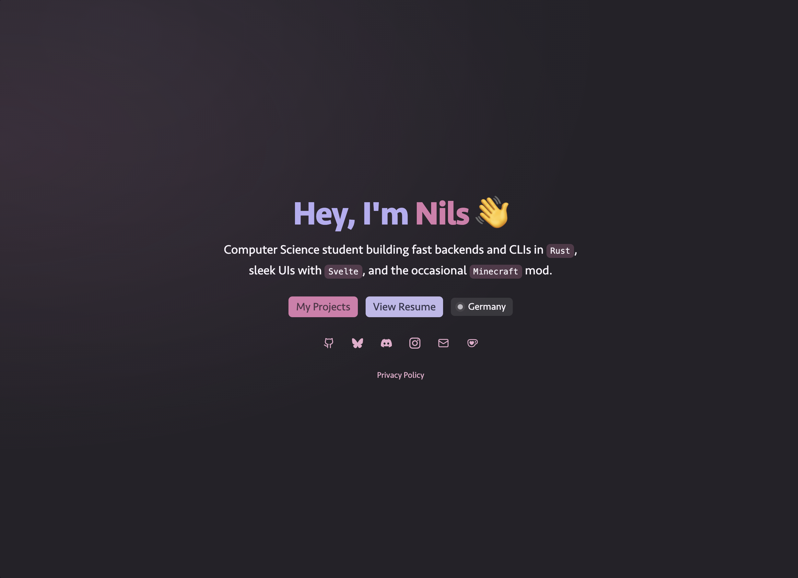

<strong>Version 10</strong> · May 2026 – Aug 2026

[View snapshot](https://github.com/nwrenger/portfolio/tree/355918b)

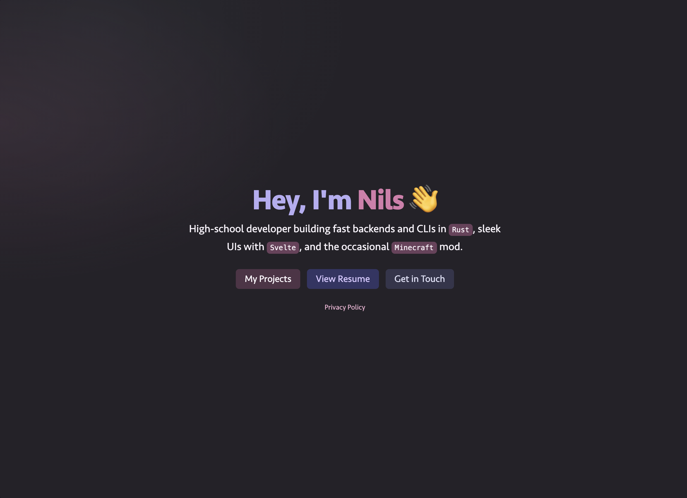

<strong>Version 9</strong> · Mar 2026 – May 2026

[View snapshot](https://github.com/nwrenger/portfolio/tree/50e312c)

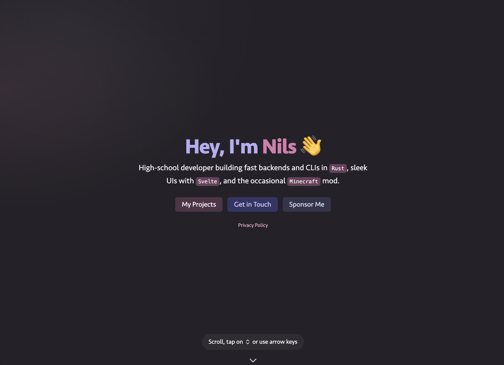

<strong>Version 8</strong> · Feb 2025 – Mar 2026

[View snapshot](https://github.com/nwrenger/portfolio/tree/0476149)

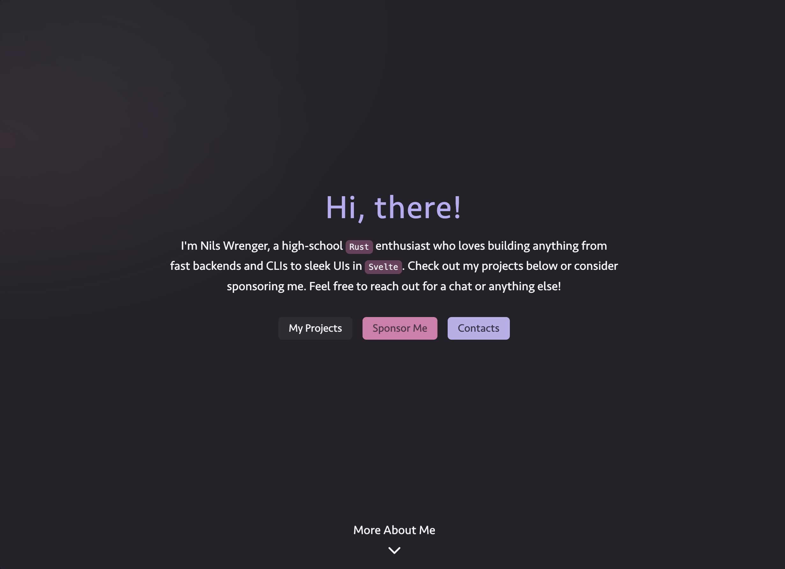

<strong>Version 7</strong> · Nov 2024 – Feb 2025

[View snapshot](https://github.com/nwrenger/portfolio/tree/786e060)

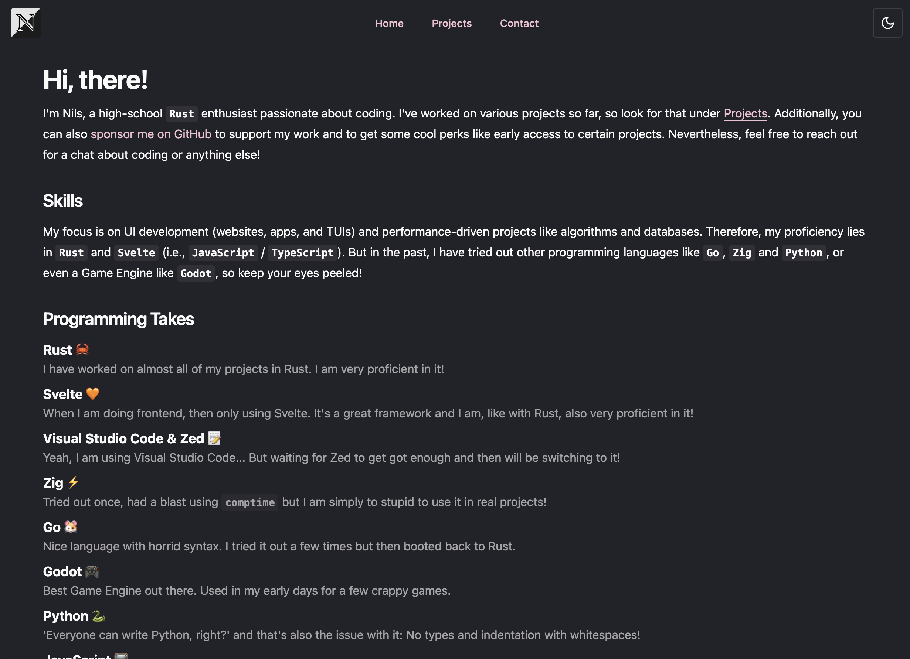

<strong>Version 6</strong> · Jul 2024 – Nov 2024

[View snapshot](https://github.com/nwrenger/portfolio/tree/e8834bf)

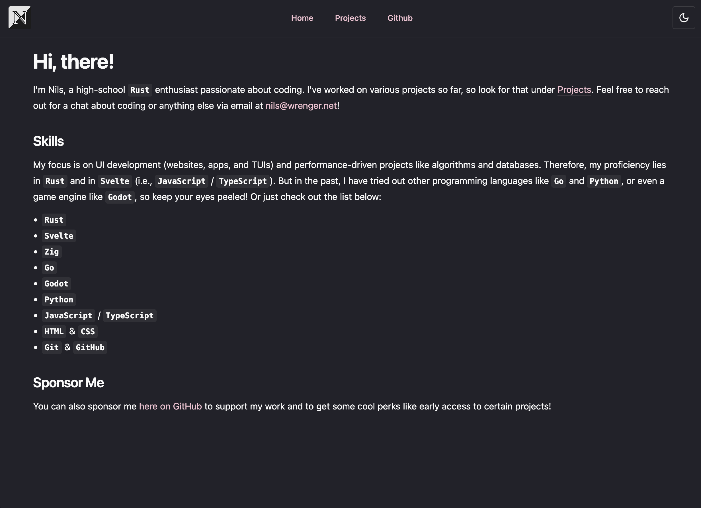

<strong>Version 5</strong> · Apr 2024 – Jul 2024

[View snapshot](https://github.com/nwrenger/portfolio/tree/0a2b762)

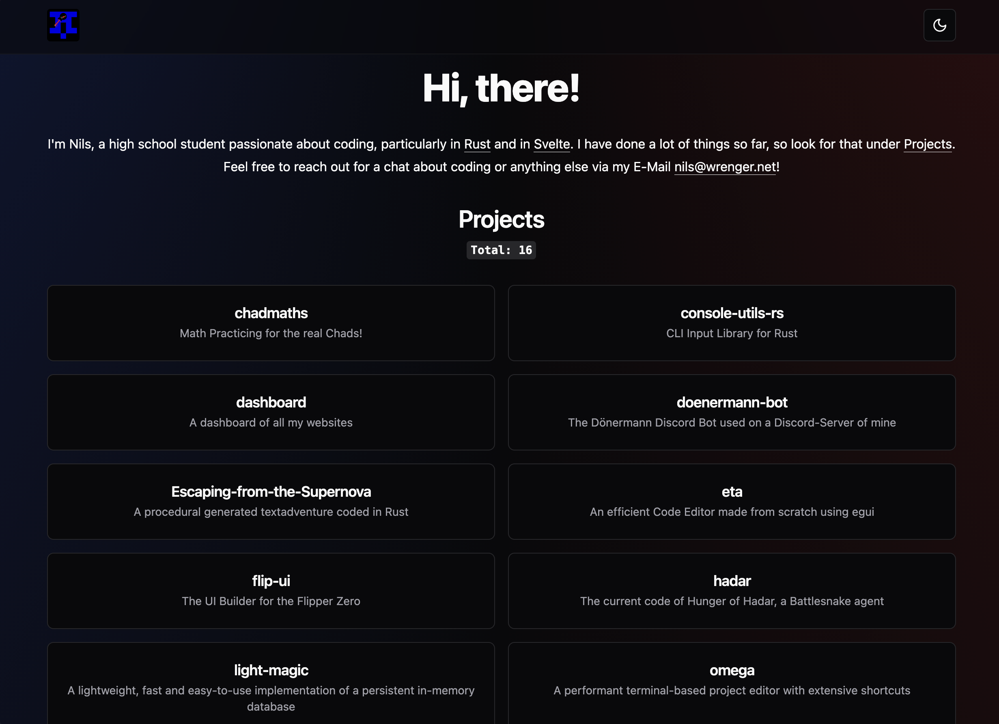

<strong>Version 4</strong> · Mar 2024 – Apr 2024

[View snapshot](https://github.com/nwrenger/portfolio/tree/ee2ecc7)

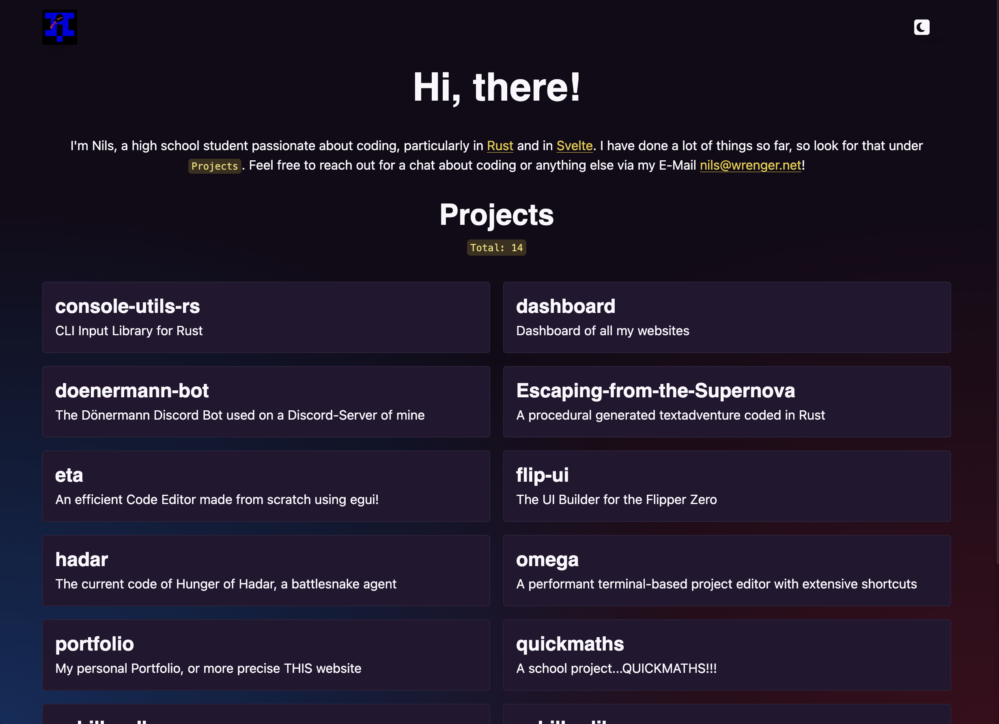

<strong>Version 3</strong> · Feb 2024 – Mar 2024

[View snapshot](https://github.com/nwrenger/portfolio/tree/d3050a7)

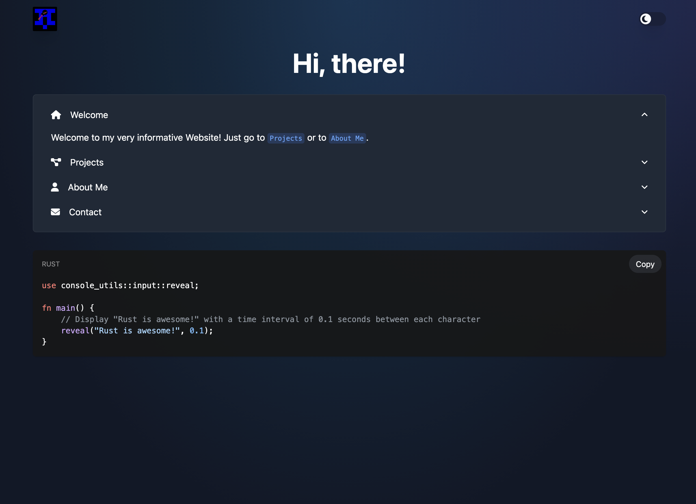

<strong>Version 2</strong> · Dec 2023 – Feb 2024

[View snapshot](https://github.com/nwrenger/portfolio/tree/2e777c7)

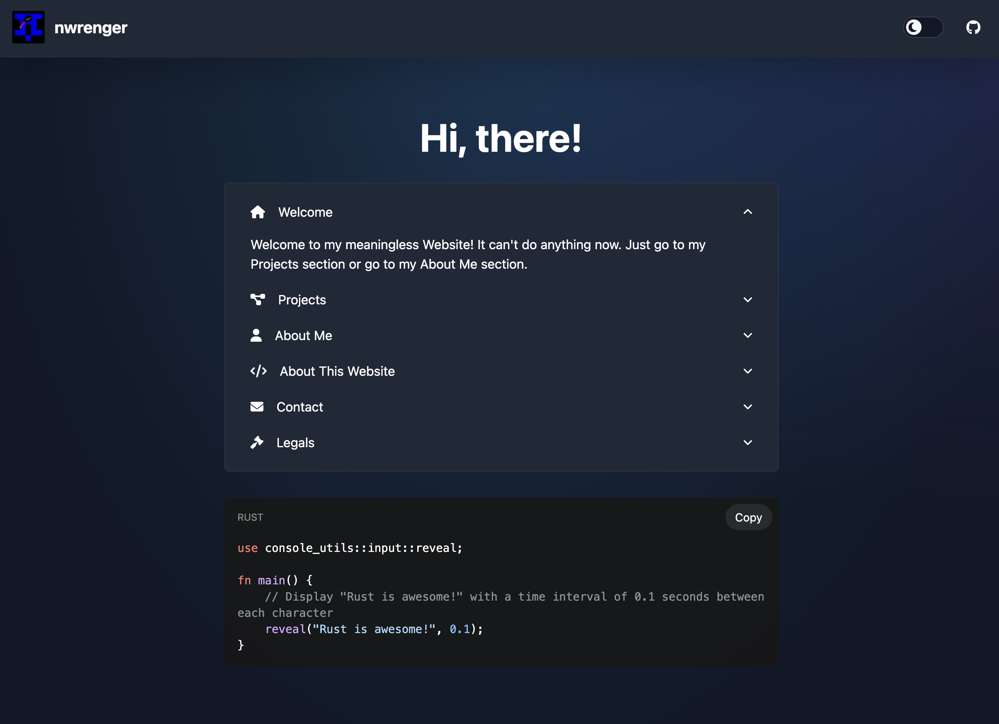

<strong>Version 1</strong> · Jul/Aug 2023 – Dec 2023

[View snapshot](https://github.com/nwrenger/portfolio/tree/2780430)

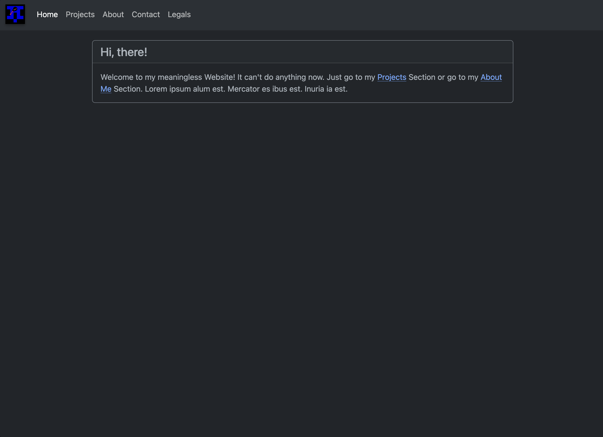

